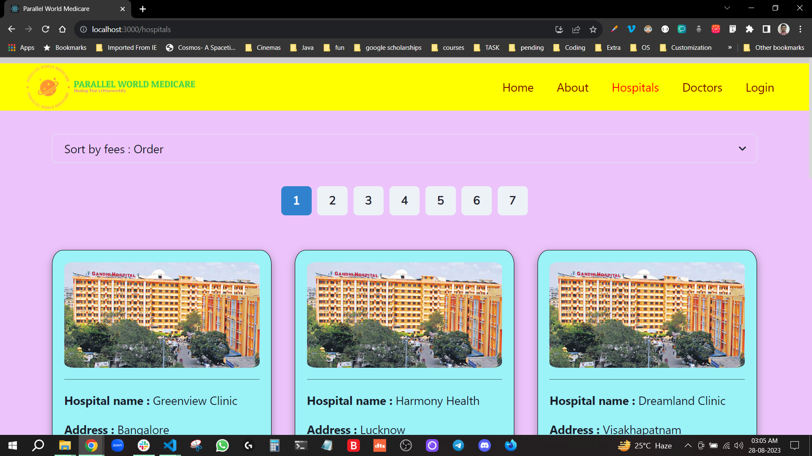

# Parallel World Medicare

Tag line : Healing That's Otherworldly.

## Table of Contents

- [This is a React Project built for practice purposes the website is on theme of and medical care site it consists basic functionality but more focus is on UI the project contains Home page, About Page, Doctors page, Hospitals Page, Register Page and Login Page.](#description)

- [Features](#features)

1. Heavily uses Chakra UI.
2. Register functionality.
3. Login functionality.
4. Sort functionality.
5. Good Home page and About page designs.

- [Screenshots](#screenshots)

<!-- 


 -->





## Installation

1. Clone the repository:

   ```sh
   git clone https://github.com/your-username/your-repo.git
   ```

2. navigate to project folder:

   ```sh
   cd parallel-world-medicare
   ```

3. install the required dependencies:

   ```sh
   npm install react-icons
   npm install react-router-dom@6
   npm install babel-plugin-macros
   npm i @chakra-ui/react @emotion/react @emotion/styled framer-motion
   ```

4. start the frontend server:

   ```sh
   npm run start
   ```

## Usage

1. After following the installation steps, open your web browser.
2. Navigate to http://localhost:3000 to access the website.
3. Explore the different features and sections of the website.
4. Interact with the elements and see the content.
5. Enjoy using the website and provide feedback!

## Contributing

Contributions are welcome! Here's how you can get involved:

1. Fork the repository.
2. Create a new branch for your feature or bug fix:
   ```sh
   git checkout -b feature-name
   ```
3. Make your changes and commit them:
   ```sh
   git commit -m "Add your message here"
   ```
4. Push your changes to your forked repository:
   ```sh
   git push origin feature-name
   ```
5. Open a pull request on GitHub and provide details about your changes.

## production link

https://parallel-world-medicare.vercel.app/
